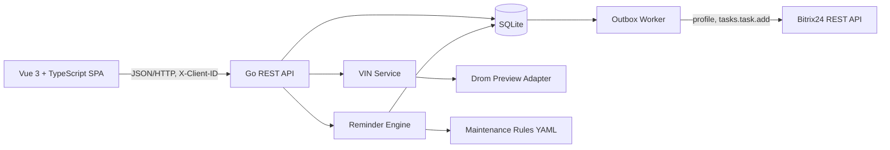

# ADR-001: MVP сервиса обслуживания автомобиля и уведомлений в Bitrix24

- **Статус:** Accepted for MVP
- **Дата:** 2026-07-11
- **Временное ограничение:** 5 часов календарного времени
- **Команда:** 3 параллельных Codex-агента
- **Стек:** Go backend, Vue 3 + TypeScript frontend
- **Area:** cross-cutting
- **Имя продукта:** servys (в коде встречается `carcare` — привести к `servys`)
- **Связь со спекой:** `docs/superpowers/specs/2026-07-11-servys-mvp-design.md`
- **Область решения:** демонстрационный MVP; перед production-запуском ADR должен быть пересмотрен

---

## 0. Согласование со спекой (после ревью 2026-07-11)

Расхождения ADR и спеки сведены; приняты решения:

- **Швы:** сохраняем порты `Recommender` / `Sink` / `Tenant` из спеки; функционал этого ADR
  (`VINProvider`, rules-engine, движок напоминаний, outbox, alerts) встраивается **за** этими портами.
  `Recommender` = источник правил (YAML + LLM), движок напоминаний считает alerts по правилам и пробегу.
- **Данные:** гибрид — YAML (верифиц., демо) + LLM (Claude) для моделей вне YAML.
- **VIN/Drom:** оставляем, но **основной путь — ручной ввод**, VIN опционален.
- **Bitrix:** **только на уровне b2b и отложен** (под вопросом). В изначальной сборке Bitrix НЕТ.
  Причина: `tasks.task.add` ставит задачу на ответственного — осмысленно только у автосервиса (b2b);
  частнику (b2c) ставить некому. Раздел 5.8 и связанные с Bitrix — это уже b2b-этап.
- **Изначально делаем:** фронт + бэк + **рекомендационный слой** (b2c). Мульти-авто, юзеры,
  история пробега, шедулер — **оставляем**.
- **API:** модель `vehicles`/`alerts` из этого ADR замещает `/recommendations`.
  ⚠️ Фронт Dev 2 строился на `/recommendations` — **нужен переalign** (см. спеку §4.A).

## 1. Контекст

Нужно реализовать сервис, который:

1. добавляет автомобиль по VIN;
2. пытается бесплатно получить базовые характеристики автомобиля со страницы Drom;
3. позволяет вручную исправить или дополнить результат;
4. хранит текущий пробег и историю его обновлений;
5. рассчитывает события обслуживания по локальной базе правил;
6. напоминает раз в 30 дней обновить пробег;
7. формирует предупреждение, когда приближается или наступает обслуживание;
8. позволяет каждому пользователю подключить собственный портал Bitrix24 через входящий webhook;
9. создает задачу в Bitrix24 для напоминания об обновлении пробега или обслуживании.

Ограничение в 5 часов исключает полноценную production-реализацию: коммерческие базы регламентов, надежную авторизацию, OAuth-приложение Bitrix24, распределенную очередь, OCR документов, LLM-конвейер сбора знаний и поддержку всех марок автомобилей.

---

## 2. Решение в одном абзаце

Создается **модульный монолит**: один Go-процесс обслуживает REST API, SQLite, планировщик и очередь исходящих уведомлений; Vue SPA работает отдельно через Vite. VIN определяется best-effort-парсером бесплатной страницы Drom, изолированным интерфейсом `VINProvider`, с обязательным ручным fallback. Правила обслуживания хранятся в версионированном YAML-файле и загружаются при запуске. Напоминания рассчитываются детерминированным движком, записываются в таблицу alerts/outbox и идемпотентно отправляются в Bitrix24 методом `tasks.task.add`. Пользователь идентифицируется временным browser token из `localStorage`; это сознательное ограничение MVP, а не production-аутентификация.

---

## 3. Цели MVP

### 3.1. Обязательные возможности P0

- добавить несколько автомобилей одному пользователю;
- определить базовые параметры по VIN через Drom;
- продолжить работу вручную, если Drom недоступен или вернул неполные данные;
- сохранить пробег;
- обновить пробег и запретить случайное уменьшение значения;
- показать список правил и текущие статусы;
- создать напоминание об устаревшем пробеге после 30 дней;
- создать напоминание о приближающемся или наступившем обслуживании;
- подключить входящий webhook Bitrix24 и проверить его через `profile`;
- создать задачу Bitrix24 методом `tasks.task.add`;
- не создавать дубликат задачи при повторном запуске планировщика;
- не возвращать и не логировать секрет webhook;
- запускаться одной командой для демонстрации.

### 3.2. Желательные возможности P1

- отметить обслуживание выполненным;
- пересчитать следующий срок после выполненной работы;
- повторять неуспешную отправку в Bitrix24 с backoff;
- поддерживать интервалы и по пробегу, и по времени;
- показать историю пробега и отправок.

### 3.3. Не входит в MVP

- достоверная база регламентов для всех автомобилей;
- автоматическое определение точного кода двигателя и коробки по любому VIN;
- обход CAPTCHA, антибот-защиты или блокировок Drom;
- Playwright/Chromium для динамического рендеринга Drom;
- LLM-поиск неисправностей и форумных отзывов;
- OAuth и публикация приложения в Bitrix24 Marketplace;
- CRM-сущности, сделки и смарт-процессы Bitrix24;
- обратная синхронизация статуса задачи из Bitrix24;
- push, email, Telegram и SMS;
- production-аутентификация и восстановление доступа;
- PostgreSQL, Redis, Kafka/RabbitMQ, Kubernetes;
- мобильное приложение.

---

## 4. Архитектурная схема



### 4.1. Форма развертывания

Для MVP используются два процесса:

```text
frontend: Vite dev server, :5173
backend:  Go API + scheduler + worker, :8080
```

SQLite хранится в локальном volume `./data/app.db`.

Разделение на микросервисы отклонено: при пятичасовом timebox оно увеличивает объем конфигурации, сетевых контрактов и диагностики, не добавляя ценности демонстрации.

---

## 5. Ключевые архитектурные решения

### 5.1. Backend

- Go;
- `net/http` + `github.com/go-chi/chi/v5`;
- `database/sql` + `modernc.org/sqlite`;
- один бинарник;
- SQL-миграции выполняются при запуске;
- зависимости передаются через явный `App`/constructor wiring, без DI-фреймворка.

### 5.2. Frontend

- Vue 3;
- TypeScript;
- Vite;
- Composition API;
- Pinia не обязателен: для четырех экранов достаточно composables и локального состояния;
- один SPA с Vue Router либо вкладками; визуальная сложность не является целью.

### 5.3. Временная идентификация пользователя

При первом открытии frontend генерирует UUID и сохраняет его в `localStorage` под ключом `carcare.clientId`. Все API-запросы содержат:

```http
X-Client-ID: <uuid>
```

Backend создает или находит пользователя по этому ключу.

**Последствие:** данные разделяются между браузерными клиентами, но такой механизм не защищает учетную запись. Перед production он должен быть заменен на обычную аутентификацию.

### 5.4. VIN и Drom

Основной MVP-источник:

```text
https://vin.drom.ru/report/{VIN}/
```

Извлекаются только бесплатные поля, присутствующие на preview-странице:

- VIN;
- название автомобиля;
- год;
- объем двигателя;
- мощность;
- цвет;
- тип транспортного средства/кузов.

Парсер:

1. проверяет формат VIN;
2. выполняет server-side HTTP GET с timeout;
3. не следует redirect на другой host;
4. преобразует HTML в нормализованный текст;
5. ищет значения по устойчивым текстовым меткам `VIN`, `Объем`, `Мощность`, `Цвет`, `Тип ТС`;
6. проверяет совпадение VIN в ответе с запрошенным;
7. возвращает структурированный результат или типизированную ошибку.

Интерфейс:

```go
type VINProvider interface {
    Resolve(ctx context.Context, vin string) (VehicleCandidate, error)
}
```

Типизированные ошибки:

```text
INVALID_VIN
NOT_FOUND
PROVIDER_UNAVAILABLE
PROVIDER_BLOCKED
PAGE_STRUCTURE_CHANGED
INCOMPLETE_RESULT
VIN_MISMATCH
```

При любой ошибке пользователь получает ручную форму. CAPTCHA и антибот-защита не обходятся.

**Принятое ограничение:** доступность страницы не считается гарантированной. Drom находится за адаптером и может быть заменен без изменения доменной модели и frontend API.

### 5.5. База знаний по обслуживанию

В MVP правила хранятся в `backend/data/maintenance_rules.yaml`.

Пример структуры:

```yaml
version: 1
variants:
  - match:
      make: KIA
      model: K3
      year_from: 2020
      year_to: 2020
      engine_displacement_cc: 1353
      power_hp: 130
    rules:
      - code: engine_oil
        title: Моторное масло
        operation: replace
        interval_km: 10000
        interval_months: 12
        lead_km: 500
        verified: false
        source: demo
      - code: brakes
        title: Тормозная система
        operation: inspect
        interval_km: 10000
        lead_km: 500
        verified: false
        source: demo
```

Значения с `verified: false` являются демонстрационными данными и не должны позиционироваться как официальный регламент.

Если точное правило не найдено, приложение не придумывает интервал и показывает состояние `REGULATION_NOT_FOUND`.

### 5.6. Движок напоминаний

Поддерживаются типы событий:

```text
ODOMETER_UPDATE_REQUIRED
MAINTENANCE_HISTORY_REQUIRED
MAINTENANCE_SOON
MAINTENANCE_DUE
MAINTENANCE_OVERDUE
REGULATION_NOT_FOUND
```

#### Напоминание об обновлении пробега

```text
now >= odometer_updated_at + 30 дней
```

Для одного неизменившегося показания создается только одно открытое напоминание. После внесения нового пробега старое напоминание закрывается, а следующий срок начинается от новой даты.

#### Обслуживание по пробегу

Если есть последнее подтвержденное выполнение правила:

```text
next_due_km = last_service_odometer + interval_km
```

Если подтвержденной истории нет, MVP **не объявляет работу просроченной и не угадывает последнюю замену**. Создается один alert `MAINTENANCE_HISTORY_REQUIRED`, а пользователь указывает дату и пробег последнего выполнения правила. После появления baseline применяется обычный расчет.

Для демонстрации форма service event должна позволять указать не только «выполнено сейчас», но и известное прошлое обслуживание, например замену масла на 60 000 км.

Статус после появления baseline:

```text
current < next_due - lead_km  => OK
current >= next_due - lead_km => MAINTENANCE_SOON
current >= next_due           => MAINTENANCE_DUE
current >= next_due + 1000    => MAINTENANCE_OVERDUE
```

Порог `1000 км` является параметром MVP, а не универсальным автомобильным правилом.

#### Обслуживание по времени

Если задан `interval_months`, рассчитывается календарный due date. Событие считается наступившим по более раннему из пробега и даты.

### 5.7. Планировщик

Внутри Go-процесса запускается ticker:

```text
production-like default: 1 час
demo env:               1 минута
```

Дополнительно в dev-режиме доступен endpoint ручного запуска:

```http
POST /api/v1/dev/run-jobs
```

Endpoint отключается, если `APP_ENV != dev`.

### 5.8. Bitrix24

#### Выбранный механизм

MVP создает **задачу** методом:

```text
tasks.task.add
```

Причины:

- метод поддерживает входящий webhook;
- не требует предварительно созданного CRM-контакта, сделки или смарт-процесса;
- задача остается видимой в портале и имеет дедлайн;
- webhook creator может быть назначен ответственным.

`crm.activity.todo.add` отложен до этапа, когда приложение будет связывать автомобиль с CRM-сущностью. `im.notify` не выбран как основной путь, поскольку сценарии уведомлений имеют ограничения, связанные с контекстом приложения, и менее надежны для локального incoming webhook MVP.

#### Подключение

Пользователь вводит:

```text
portalUrl:  https://company.bitrix24.ru
webhookUrl: https://company.bitrix24.ru/rest/1/secret-token/
```

Backend:

1. валидирует HTTPS URL;
2. проверяет совпадение host у portal и webhook;
3. запрещает userinfo, query и fragment;
4. проверяет структуру `/rest/{user_id}/{token}/`;
5. запрещает IP literal и локальные/private адреса;
6. не следует redirect;
7. вызывает `{webhookUrl}/profile`;
8. сохраняет ID и отображаемое имя пользователя Bitrix24;
9. сохраняет webhook в зашифрованном виде.

Необходимые права webhook:

```text
basic/profile
 task
```

#### Формат задачи

Для обновления пробега:

```json
{
  "fields": {
    "TITLE": "Обновите пробег: KIA K3, 2020",
    "DESCRIPTION": "Последнее значение: 62 900 км. Обновите пробег в сервисе.",
    "RESPONSIBLE_ID": 1,
    "CREATED_BY": 1,
    "DEADLINE": "2026-08-11T12:00:00Z"
  }
}
```

Для обслуживания:

```json
{
  "fields": {
    "TITLE": "KIA K3: скоро обслуживание — моторное масло",
    "DESCRIPTION": "Текущий пробег: 69 600 км. Следующий ориентир: 70 000 км. Источник правила: demo.",
    "RESPONSIBLE_ID": 1,
    "CREATED_BY": 1,
    "DEADLINE": "2026-07-18T12:00:00Z"
  }
}
```

#### Защита webhook

- AES-256-GCM;
- ключ в `APP_SECRET_KEY`;
- секрет никогда не возвращается API;
- в логах используется только маска `https://host/rest/1/***/`;
- HTTP timeout — 5 секунд;
- response body ограничен по размеру;
- ошибки Bitrix24 сохраняются без полного URL.

### 5.9. Outbox и идемпотентность

Alert и его доставка разделены:

```text
Reminder Engine -> alerts -> notification_outbox -> Bitrix Worker
```

Уникальный `dedupe_key`:

```text
ODOMETER:<vehicle_id>:<last_odometer_reading_id>
MAINTENANCE:<vehicle_id>:<rule_code>:<due_km_or_date>
```

На `notification_outbox.dedupe_key` создается UNIQUE index.

Повторный запуск планировщика не создает вторую задачу. После успешной отправки сохраняется `remote_task_id`.

Backoff:

```text
1 минута -> 5 минут -> 30 минут -> 1 час
```

После пяти попыток статус становится `dead`; пользователь видит ошибку в UI и может повторить отправку вручную.

---

## 6. Пользовательские сценарии

### S01. Первый запуск

1. Frontend создает `clientId`.
2. Вызывает `GET /api/v1/me`.
3. Backend создает пользователя, если его еще нет.
4. Пользователь видит пустой гараж.

**Результат:** создан изолированный workspace браузера.

### S02. Успешное добавление по VIN

1. Пользователь вводит VIN.
2. Frontend вызывает `POST /api/v1/vin/resolve`.
3. Drom adapter возвращает базовые характеристики.
4. Пользователь подтверждает/исправляет значения и вводит пробег.
5. Frontend вызывает `POST /api/v1/vehicles`.
6. Backend сохраняет автомобиль и первое показание пробега.

**Результат:** автомобиль отображается в гараже.

### S03. Drom вернул неполные данные

1. VIN найден, но отсутствует часть полей.
2. Ответ содержит `missingFields`.
3. Frontend показывает найденное и ручные поля для дополнения.

**Результат:** пользователь может продолжить без повторного запроса.

### S04. Drom недоступен, изменил страницу или заблокировал запрос

1. Backend возвращает типизированную ошибку provider-а.
2. Frontend сообщает, что автоматическое определение временно недоступно.
3. Открывается ручная форма.

**Результат:** основной пользовательский путь не блокируется.

### S05. Ручное добавление автомобиля

Пользователь вводит VIN или оставляет его пустым, указывает марку, модель, год, объем, мощность, кузов и пробег.

**Результат:** автомобиль сохраняется с `identificationSource=manual`.

### S06. Обновление пробега

1. Пользователь открывает автомобиль.
2. Вводит новое значение.
3. Backend проверяет, что значение не меньше предыдущего.
4. Создает odometer reading и обновляет карточку.
5. Закрывает открытое `ODOMETER_UPDATE_REQUIRED`.
6. Пересчитывает maintenance alerts.

**Результат:** план обслуживания актуализирован.

### S07. Уменьшение пробега

По умолчанию backend отвечает `ODOMETER_DECREASE_NOT_ALLOWED`.

В MVP нет отдельного сценария замены приборной панели или корректировки показаний. Ошибочное значение можно исправить только через dev/admin-инструмент либо напрямую в БД.

### S08. Пробег не обновлялся 30 дней

1. Scheduler находит автомобиль с устаревшим показанием.
2. Создает alert и outbox item.
3. При наличии Bitrix connection worker создает задачу.
4. При отсутствии Bitrix connection alert остается видимым только в приложении.

### S09. История обслуживания для правила неизвестна

1. Для применимого правила отсутствует `service_event`.
2. Создается `MAINTENANCE_HISTORY_REQUIRED` без категоричного требования замены.
3. Пользователь указывает известную дату и пробег последнего выполнения либо отмечает работу выполненной сейчас.
4. После сохранения baseline движок рассчитывает следующий срок.

### S10. Обслуживание приближается

1. Текущий пробег входит в `lead_km` до следующего интервала.
2. Создается `MAINTENANCE_SOON`.
3. В Bitrix24 создается задача с ориентиром пробега и пометкой об источнике правила.

### S11. Обслуживание наступило или просрочено

1. Пробег или дата превышают due threshold.
2. Alert повышает severity.
3. Если для того же `dedupe_key` задача уже создана, новая задача не создается.
4. Существующий alert обновляется.

### S12. Пользователь отметил обслуживание выполненным

1. Нажимает «Выполнено».
2. Указывает дату и пробег, по умолчанию текущие.
3. Backend создает `service_event`.
4. Открытый alert закрывается.
5. Следующий срок рассчитывается от события обслуживания.

### S13. Подключение Bitrix24

1. Пользователь вводит portal URL и webhook URL.
2. Backend вызывает `profile`.
3. При успехе показывает имя пользователя Bitrix24 и статус «Подключено».
4. Webhook сохраняется зашифрованно.

### S14. Неверный webhook или недостаточные права

1. `profile` либо `tasks.task.add` возвращает ошибку.
2. Connection получает `status=error`.
3. UI показывает безопасное описание: неверный URL, авторизация, scope или права.
4. Полный токен не показывается.

### S15. Тестовое уведомление Bitrix24

Пользователь нажимает «Отправить тест». Backend создает outbox item с отдельным `dedupe_key` и задачу «Тестовое уведомление сервиса».

### S16. Временная ошибка Bitrix24

1. Worker получает timeout, 429 или 5xx.
2. Увеличивает `attempts` и назначает `next_attempt_at`.
3. Повторяет отправку.
4. После пяти ошибок переводит item в `dead`.

### S17. Несколько автомобилей

Каждый alert, service event, odometer reading и outbox item содержит `vehicle_id`; данные разных автомобилей не смешиваются.

### S18. Несколько пользователей

Каждый запрос фильтруется по `user_id`, полученному из `X-Client-ID`. Прямой запрос чужого `vehicle_id` возвращает 404, а не 403, чтобы не подтверждать существование объекта.

### S19. Правило не найдено

Автомобиль сохраняется, но maintenance engine не создает выдуманные рекомендации. UI показывает «Для этой модификации регламент пока не добавлен».

### S20. Bitrix24 не подключен

Все alerts работают внутри приложения. Outbox для Bitrix не создается до подключения либо создается только после явного теста; старые alerts не рассылаются массово автоматически при первом подключении.

### S21. Отключение Bitrix24

Webhook ciphertext удаляется, connection становится disabled. Уже созданные задачи в портале не удаляются.

---

## 7. Модель данных

```sql
users (
  id TEXT PRIMARY KEY,
  client_key TEXT UNIQUE NOT NULL,
  created_at DATETIME NOT NULL
);

vehicles (
  id TEXT PRIMARY KEY,
  user_id TEXT NOT NULL,
  vin TEXT,
  make TEXT NOT NULL,
  model TEXT NOT NULL,
  year INTEGER,
  engine_displacement_cc INTEGER,
  power_hp INTEGER,
  color TEXT,
  body_type TEXT,
  identification_source TEXT NOT NULL,
  current_odometer INTEGER NOT NULL,
  odometer_updated_at DATETIME NOT NULL,
  created_at DATETIME NOT NULL,
  updated_at DATETIME NOT NULL
);

odometer_readings (
  id TEXT PRIMARY KEY,
  vehicle_id TEXT NOT NULL,
  value INTEGER NOT NULL,
  recorded_at DATETIME NOT NULL,
  created_at DATETIME NOT NULL
);

service_events (
  id TEXT PRIMARY KEY,
  vehicle_id TEXT NOT NULL,
  rule_code TEXT NOT NULL,
  odometer INTEGER NOT NULL,
  performed_at DATETIME NOT NULL,
  created_at DATETIME NOT NULL
);

alerts (
  id TEXT PRIMARY KEY,
  user_id TEXT NOT NULL,
  vehicle_id TEXT NOT NULL,
  type TEXT NOT NULL,
  rule_code TEXT,
  dedupe_key TEXT UNIQUE NOT NULL,
  severity TEXT NOT NULL,
  status TEXT NOT NULL,
  title TEXT NOT NULL,
  description TEXT NOT NULL,
  due_odometer INTEGER,
  due_at DATETIME,
  history_unknown BOOLEAN NOT NULL DEFAULT FALSE,
  created_at DATETIME NOT NULL,
  updated_at DATETIME NOT NULL,
  resolved_at DATETIME
);

bitrix_connections (
  user_id TEXT PRIMARY KEY,
  portal_url TEXT NOT NULL,
  webhook_ciphertext BLOB NOT NULL,
  webhook_nonce BLOB NOT NULL,
  remote_user_id TEXT NOT NULL,
  remote_user_name TEXT,
  status TEXT NOT NULL,
  last_error TEXT,
  created_at DATETIME NOT NULL,
  updated_at DATETIME NOT NULL
);

notification_outbox (
  id TEXT PRIMARY KEY,
  user_id TEXT NOT NULL,
  alert_id TEXT,
  dedupe_key TEXT UNIQUE NOT NULL,
  kind TEXT NOT NULL,
  payload_json TEXT NOT NULL,
  status TEXT NOT NULL,
  attempts INTEGER NOT NULL DEFAULT 0,
  next_attempt_at DATETIME NOT NULL,
  remote_task_id TEXT,
  last_error TEXT,
  created_at DATETIME NOT NULL,
  sent_at DATETIME
);
```

---

## 8. REST API MVP

Все endpoint-ы, кроме health, требуют `X-Client-ID`.

### Общие

```text
GET  /api/v1/health
GET  /api/v1/me
```

### VIN и автомобили

```text
POST   /api/v1/vin/resolve
POST   /api/v1/vehicles
GET    /api/v1/vehicles
GET    /api/v1/vehicles/{vehicleId}
PATCH  /api/v1/vehicles/{vehicleId}/odometer
GET    /api/v1/vehicles/{vehicleId}/alerts
POST   /api/v1/vehicles/{vehicleId}/service-events
```

### Bitrix24

```text
GET     /api/v1/bitrix/connection
PUT     /api/v1/bitrix/connection
DELETE  /api/v1/bitrix/connection
POST    /api/v1/bitrix/test
```

### Dev-only

```text
POST /api/v1/dev/run-jobs
```

### Пример `POST /api/v1/vin/resolve`

Request:

```json
{
  "vin": "LJD3AA293L0051345"
}
```

Response:

```json
{
  "candidate": {
    "vin": "LJD3AA293L0051345",
    "displayName": "KIA K3",
    "make": "KIA",
    "model": "K3",
    "year": 2020,
    "engineDisplacementCc": 1353,
    "powerHp": 130,
    "color": "Белый",
    "bodyType": "Легковой седан",
    "source": "drom_preview",
    "missingFields": ["transmission", "engineCode", "drivetrain"]
  }
}
```

### Формат ошибки

```json
{
  "error": {
    "code": "PROVIDER_UNAVAILABLE",
    "message": "Автоматическое определение временно недоступно. Заполните данные вручную."
  }
}
```

Техническое сообщение внешнего сервиса не передается пользователю без нормализации.

---

## 9. Структура репозитория

```text
/
├── ADR-001-car-maintenance-mvp.md
├── Makefile
├── README.md
├── docker-compose.yml                 # опционально; backend + frontend
├── backend/
│   ├── go.mod
│   ├── cmd/api/main.go
│   ├── data/maintenance_rules.yaml
│   ├── migrations/
│   │   ├── 001_core.sql
│   │   └── 002_integrations.sql
│   └── internal/
│       ├── app/
│       ├── contracts/
│       ├── domain/
│       ├── httpapi/
│       ├── maintenance/
│       ├── scheduler/
│       ├── store/
│       └── integrations/
│           ├── drom/
│           │   └── testdata/
│           └── bitrix/
└── frontend/
    ├── package.json
    ├── vite.config.ts
    └── src/
        ├── api/
        ├── components/
        ├── views/
        ├── composables/
        └── types/
```

---

## 10. Разделение работы между 3 Codex-агентами

### 10.1. Общий протокол

Работа ведется в трех независимых git worktree/branch:

```text
agent/core
agent/integrations
agent/frontend
```

Владелец интеграции и финального merge — **Агент 1**.

Правила:

1. первые 20 минут — contract-first;
2. после commit `contract-v1` публичные DTO и endpoint paths не меняются без сообщения остальным агентам;
3. каждый агент редактирует только закрепленные каталоги;
4. изменения должны быть небольшими и коммититься по завершенным вертикальным кускам;
5. запрещены массовые форматирования чужих файлов;
6. перед передачей ветки агент запускает собственные тесты/build;
7. блокирующий вопрос фиксируется немедленно, но агент продолжает работу с mock/stub;
8. merge выполняется не позднее T+3:30.

### 10.2. Агент 1 — Core backend, данные, API, интеграция

**Владение:**

```text
backend/cmd/**
backend/internal/app/**
backend/internal/contracts/**
backend/internal/domain/**
backend/internal/httpapi/**, кроме bitrix-specific helper при договоренности
backend/internal/maintenance/**
backend/internal/scheduler/**
backend/internal/store/core*.go
backend/migrations/001_core.sql
backend/data/**
backend/go.mod
backend/go.sum
```

**Задачи:**

1. создать Go module и HTTP server;
2. создать `contract-v1`: DTO, interfaces, routes;
3. реализовать `X-Client-ID` middleware;
4. реализовать SQLite migrations;
5. реализовать users, vehicles, odometer readings, service events, alerts;
6. реализовать YAML rules loader;
7. реализовать reminder engine;
8. реализовать scheduler и dev run endpoint;
9. реализовать REST handlers, используя `VINProvider` и Bitrix/outbox interfaces;
10. интегрировать ветки агентов 2 и 3;
11. запустить общий smoke test.

**Результат к T+3:10:**

- backend компилируется с mock VIN и mock notifier;
- CRUD основного сценария работает;
- table-driven tests alert engine проходят;
- OpenAPI/route contract зафиксирован.

**Не делает:**

- HTML-парсер Drom;
- HTTP client Bitrix24;
- Vue UI.

### 10.3. Агент 2 — Drom, Bitrix24, шифрование, outbox delivery

**Владение:**

```text
backend/internal/integrations/drom/**
backend/internal/integrations/bitrix/**
backend/internal/store/integrations*.go
backend/internal/notification/**
backend/migrations/002_integrations.sql
```

`go.mod` и общие contracts не редактируются после `contract-v1`; недостающая dependency сообщается Агенту 1.

**Задачи:**

1. реализовать Drom HTTP client и parser;
2. добавить HTML fixture для VIN `LJD3AA293L0051345`;
3. покрыть parser table tests;
4. реализовать URL validation и SSRF-minimum checks;
5. реализовать AES-GCM encryption/decryption webhook URL;
6. реализовать Bitrix `profile` validation;
7. реализовать Bitrix `tasks.task.add`;
8. реализовать outbox worker, dedupe и retry/backoff;
9. реализовать `httptest`-тесты Bitrix client;
10. вернуть безопасные typed errors.

**Результат к T+3:10:**

- parser стабильно извлекает данные из fixture;
- live fetch работает best-effort, но не ломает ручной fallback;
- webhook можно проверить через mock Bitrix;
- task payload соответствует contract;
- секрет не появляется в логах и JSON response.

**Не делает:**

- core vehicle handlers;
- maintenance calculations;
- Vue UI.

### 10.4. Агент 3 — Vue frontend, demo UX, DevEx

**Владение:**

```text
frontend/**
README.md
Makefile
docker-compose.yml
scripts/smoke.sh
```

**Задачи:**

1. создать Vue 3 + TS + Vite проект;
2. создать API client с `X-Client-ID`;
3. реализовать экран «Гараж»;
4. реализовать VIN lookup + confirm + manual fallback;
5. реализовать карточку автомобиля и обновление пробега;
6. показать alerts и maintenance statuses;
7. реализовать кнопку «Выполнено»;
8. реализовать настройки Bitrix24 и test notification;
9. показать loading/error/success states;
10. добавить README и команды запуска;
11. добавить smoke script для backend API;
12. обеспечить `npm run build` и `npm run typecheck`.

**Результат к T+3:10:**

- UI полностью работает на mock API либо contract fixtures;
- после merge переключается на реальный backend без изменения DTO;
- основной demo flow укладывается в 2–3 минуты.

**Не делает:**

- Go backend;
- Drom parser;
- Bitrix HTTP client.

---

## 11. Copy-paste briefs для Codex-агентов

### Агент 1

```text
Ты интеграционный владелец MVP. Работай только в зоне Agent 1 из ADR-001.
Сначала за 20 минут создай contract-v1: Go DTO, interfaces VINProvider и Bitrix/Outbox,
route constants, core migration и компилируемый server skeleton. Сделай commit contract-v1.
Затем реализуй SQLite core store, X-Client-ID tenancy, vehicles, odometer, service events,
YAML maintenance rules, reminder engine, alerts, scheduler и REST handlers.
До интеграции используй mocks. Не реализуй Drom/Bitrix clients и не редактируй frontend.
Пиши table-driven tests. Не меняй публичный контракт после contract-v1 без крайней необходимости.
К T+3:10 нужен компилируемый backend и passing tests. После этого смержи Agent 2 и Agent 3,
устрани только интеграционные ошибки и проведи e2e smoke.
```

### Агент 2

```text
Работай только в зоне Agent 2 из ADR-001. Дождись/прочитай contract-v1 и не меняй его.
Реализуй Drom VINProvider: HTTP timeout, no cross-host redirects, нормализация HTML текста,
regex/label parsing, VIN match, typed errors, fixture и tests. Не обходи CAPTCHA.
Реализуй Bitrix client: validate webhook URL, profile, tasks.task.add, safe errors.
Webhook хранится AES-GCM; никогда не логируй и не возвращай token.
Реализуй integration migration/store helpers и outbox worker с unique dedupe, remote task id,
retry 1m/5m/30m/1h, max 5. Используй httptest для Bitrix.
Не трогай core handlers, maintenance engine, frontend и go.mod без согласования.
К T+3:10 дай один или несколько чистых commits и команды проверки.
```

### Агент 3

```text
Работай только в зоне Agent 3 из ADR-001. Используй contract-v1 как источник истины.
Создай Vue 3 + TypeScript + Vite SPA. Генерируй clientId в localStorage и передавай X-Client-ID.
Реализуй: гараж, VIN lookup, подтверждение/ручной fallback, добавление авто с пробегом,
детальную карточку, обновление пробега, alerts, отметку обслуживания, настройки Bitrix24,
проверку подключения и тестовую задачу. До готовности backend используй mock adapter,
который легко отключается env-переменной. Не усложняй дизайн и не добавляй UI-библиотеку,
если она не ускоряет работу. Добавь README, Makefile и smoke script.
К T+3:10 должны проходить npm run typecheck и npm run build.
```

---

## 12. Пятичасовой план

| Время | Агент 1 | Агент 2 | Агент 3 | Контрольная точка |
|---|---|---|---|---|
| 0:00–0:20 | scaffold, contracts, routes, interfaces | изучает contract draft, готовит fixtures и payloads | scaffold Vue по draft contract | `contract-v1` commit |
| 0:20–1:20 | SQLite core, tenancy, vehicle API | Drom parser + tests | garage + VIN/manual flow | backend и frontend отдельно запускаются |
| 1:20–2:20 | rules loader + reminder engine | Bitrix profile/task client + tests | vehicle details + odometer + alerts | mock vertical flows готовы |
| 2:20–3:10 | scheduler, service events, API polish | encryption + outbox + retry | Bitrix settings + error states + build | feature freeze |
| 3:10–3:35 | merge Agent 2 | помогает с merge defects | публикует frontend commit | backend с реальными adapters |
| 3:35–4:00 | merge Agent 3, CORS/proxy | исправляет только integration bugs | исправляет только API mismatch | полный стек поднимается |
| 4:00–4:30 | e2e demo flow | реальный/ mock Bitrix test | UX fixes | acceptance checklist |
| 4:30–4:50 | критические баги, no new features | критические баги | README/demo polish | release candidate |
| 4:50–5:00 | tag/demo commit | stop | stop | демонстрация |

### 12.1. Порядок урезания scope при отставании

Убирать сверху вниз:

1. график/историю пробега в UI;
2. time-based maintenance UI, сохранив поля в модели;
3. автоматический ticker, оставив dev manual run;
4. UI истории доставок;
5. повторную отправку вручную;
6. второй maintenance rule.

Не убирать:

- ручной fallback после Drom;
- tenant filtering;
- webhook masking/encryption;
- URL validation;
- idempotency;
- тест создания задачи Bitrix24;
- один полностью работающий end-to-end сценарий.

---

## 13. Интеграционные контракты

### 13.1. `VINProvider`

```go
type VehicleCandidate struct {
    VIN                  string
    DisplayName          string
    Make                 string
    Model                string
    Year                 *int
    EngineDisplacementCC *int
    PowerHP              *int
    Color                string
    BodyType             string
    Source               string
    MissingFields        []string
}

type VINProvider interface {
    Resolve(context.Context, string) (VehicleCandidate, error)
}
```

### 13.2. `BitrixClient`

```go
type PortalProfile struct {
    UserID   string
    UserName string
}

type BitrixTask struct {
    Title       string
    Description string
    Deadline    time.Time
    Responsible string
}

type BitrixClient interface {
    Validate(context.Context, string) (PortalProfile, error)
    CreateTask(context.Context, string, BitrixTask) (remoteTaskID string, err error)
}
```

Строка webhook передается в integration layer только в расшифрованном виде на время одного вызова и не сохраняется в лог-контексте.

### 13.3. Frontend API adapter

```ts
export interface ApiClient {
  resolveVin(vin: string): Promise<VinResolveResponse>
  listVehicles(): Promise<Vehicle[]>
  createVehicle(input: CreateVehicleInput): Promise<Vehicle>
  updateOdometer(vehicleId: string, value: number): Promise<Vehicle>
  getAlerts(vehicleId: string): Promise<Alert[]>
  completeService(vehicleId: string, input: ServiceEventInput): Promise<void>
  getBitrixConnection(): Promise<BitrixConnection | null>
  putBitrixConnection(input: PutBitrixConnectionInput): Promise<BitrixConnection>
  testBitrix(): Promise<void>
}
```

---

## 14. Тестирование

### Backend unit tests

- VIN validation;
- Drom parser fixture;
- Drom missing-field fixture;
- alert transition table;
- no duplicate dedupe key;
- odometer decrease rejection;
- tenant ownership filter;
- AES-GCM roundtrip;
- webhook URL validation;
- Bitrix `profile` success/error through `httptest`;
- Bitrix `tasks.task.add` payload;
- retry/backoff state transitions.

### Frontend checks

```text
npm run typecheck
npm run build
```

### Backend checks

```text
go test ./...
go vet ./...
```

### Smoke flow

1. `GET /health`;
2. resolve sample VIN or receive controlled fallback;
3. create vehicle;
4. update odometer;
5. run jobs;
6. read alert;
7. connect mock/real Bitrix;
8. send test task;
9. run jobs twice and verify one remote task.

---

## 15. Демонстрационный сценарий

1. Открыть приложение — пустой гараж.
2. Ввести `LJD3AA293L0051345`.
3. Показать найденное: `KIA K3, 2020, 1353 см³, 130 л.с., белый седан` либо ручной fallback, если Drom недоступен.
4. Подтвердить данные и установить пробег рядом с демонстрационным интервалом.
5. Указать известное прошлое обслуживание, например 60 000 км; показать `MAINTENANCE_SOON`.
6. Подключить Bitrix24 webhook; показать имя пользователя из `profile`.
7. Нажать «Отправить тест» — задача появляется в Bitrix24.
8. Выполнить `run jobs` дважды — создается только одна maintenance task.
9. Нажать «Выполнено» — alert закрывается, следующий срок пересчитывается.
10. Изменить `odometer_updated_at` тестовым способом либо использовать fixture — показать задачу «Обновите пробег».

---

## 16. Риски и меры

| Риск | Вероятность | Влияние | Решение MVP |
|---|---:|---:|---|
| Drom меняет HTML | высокая | высокая | adapter + fixture tests + manual fallback |
| Drom блокирует backend | средняя/высокая | высокая | timeout, typed error, без обхода CAPTCHA |
| Данные Drom недостаточны для точного регламента | высокая | высокая | не считать preview полной комплектацией; ручное дополнение; rule-not-found |
| Демонстрационные интервалы ошибочны | высокая | критичное | `verified=false`, source visible, без медицинско-подобных категоричных формулировок |
| Утечка webhook | средняя | критичное | AES-GCM, redaction, no response/log, HTTPS |
| SSRF через пользовательский URL | средняя | критичное | URL structure validation, deny private/IP literal, no redirects, timeout |
| Bitrix task scope отсутствует | средняя | среднее | connection test и понятная ошибка |
| У портала обязательные custom task fields | низкая/средняя | среднее | показать API error; задокументировать ограничение MVP |
| Повторные задачи | высокая без защиты | среднее | DB UNIQUE dedupe key |
| Backend перезапущен | средняя | низкое | SQLite persistence, outbox statuses |
| Browser token потерян | средняя | среднее | принято для MVP; production auth позже |
| Три агента конфликтуют в git | средняя | высокая | directory ownership, contract-v1, merge freeze T+3:10 |
| Интеграция съедает последний час | высокая | высокая | mocks, ранний compile checkpoint, feature freeze |

---

## 17. Последствия решения

### Положительные

- реалистично укладывается в 5 часов при трех агентах;
- каждый агент имеет независимую область файлов;
- VIN и Bitrix интеграции заменяемы;
- приложение продолжает работать без Drom и без Bitrix24;
- один Go-процесс и SQLite упрощают запуск;
- outbox и dedupe предотвращают наиболее неприятные ошибки уведомлений;
- архитектура допускает переход к PostgreSQL, OAuth и лицензированной базе правил.

### Отрицательные

- browser token не является безопасной аутентификацией;
- Drom scraping нестабилен и требует отдельного правового/договорного решения перед коммерческим запуском;
- база правил демонстрационная и неполная;
- встроенный scheduler не подходит для нескольких экземпляров backend без distributed lock;
- SQLite ограничивает горизонтальное масштабирование;
- задача Bitrix24 — это не чистое messenger-уведомление;
- нет обратной синхронизации выполненной задачи.

---

## 18. Условия пересмотра ADR

ADR должен быть заменен новым решением, когда выполняется хотя бы одно условие:

- начинается публичный коммерческий запуск;
- появляется более одного backend instance;
- подключается более 1000 активных автомобилей;
- требуется надежная пользовательская авторизация;
- появляется официальный VIN/API provider;
- подключается лицензированная maintenance/RMI база;
- требуется Marketplace OAuth-интеграция Bitrix24;
- требуется привязка автомобиля к CRM contact/deal/SPA;
- появляются юридические ограничения на использование Drom;
- уведомления должны отправляться не как задачи, а в messenger/push/email.

---

## 19. Acceptance criteria

MVP принят, если к концу пятого часа одновременно выполнено следующее:

- [ ] `go test ./...` проходит;
- [ ] `npm run typecheck` проходит;
- [ ] `npm run build` проходит;
- [ ] приложение поднимается по README;
- [ ] пользователь изолирован через `X-Client-ID`;
- [ ] автомобиль можно добавить по VIN либо вручную;
- [ ] данные sample VIN корректно разбираются из fixture;
- [ ] live Drom failure не блокирует ручное добавление;
- [ ] пробег сохраняется и не может уменьшиться;
- [ ] maintenance alert рассчитывается;
- [ ] stale odometer alert рассчитывается;
- [ ] webhook Bitrix24 проверяется через `profile`;
- [ ] тестовая задача создается через `tasks.task.add`;
- [ ] повторный scheduler run не создает дубликат;
- [ ] webhook token отсутствует в API response и логах;
- [ ] основной demo flow проходит за 3 минуты.

---

## 20. Источники для реализации

- Bitrix24 incoming/outgoing webhooks:  
  https://apidocs.bitrix24.com/local-integrations/local-webhooks.html
- Bitrix24 current profile:  
  https://apidocs.bitrix24.com/api-reference/common/users/profile.html
- Bitrix24 create task `tasks.task.add`:  
  https://apidocs.bitrix24.com/api-reference/tasks/tasks-task-add.html
- Возможное будущее CRM activity `crm.activity.todo.add`:  
  https://apidocs.bitrix24.com/api-reference/crm/timeline/activities/todo/crm-activity-todo-add.html
- Drom preview URL sample:  
  https://vin.drom.ru/report/LJD3AA293L0051345/

