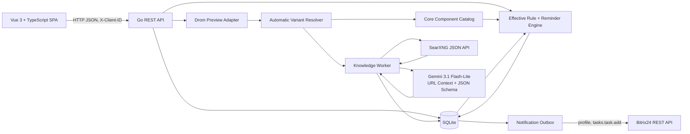

# ADR-001: MVP сервиса персонального обслуживания автомобиля и уведомлений в Bitrix24

- **Статус:** Accepted for MVP, revision 2
- **Дата:** 2026-07-11
- **Временное ограничение:** 5 часов календарного времени
- **Команда:** 3 параллельных Codex-агента
- **Стек:** Go backend, Vue 3 + TypeScript frontend, SQLite, SearXNG, Gemini API
- **Область решения:** демонстрационный MVP; перед публичным production-запуском решение должно быть пересмотрено

---

## 1. Контекст

Нужно реализовать сервис, который:

1. принимает VIN автомобиля;
2. бесплатно получает базовые сведения со страницы Drom;
3. автоматически сопоставляет автомобиль с техническим профилем без обязательных уточняющих вопросов пользователю;
4. формирует персональную базу знаний: что проверять или менять, на каком пробеге и через какой срок;
5. показывает основные элементы обслуживания сразу, даже пока точный регламент еще собирается;
6. использует LLM для поиска, чтения и нормализации максимально возможного числа источников;
7. хранит текущий пробег, историю обслуживания и пользовательские интервалы;
8. по умолчанию использует сервисный шаг 10 000 км, но позволяет указать фактический пробег и дату каждой прошлой замены;
9. ежемесячно напоминает обновить пробег;
10. предупреждает о приближении проверки или замены;
11. позволяет каждому пользователю подключить свой портал Bitrix24 через входящий webhook;
12. создает задачу в Bitrix24 именно пользователю, которому принадлежит webhook.

Ограничение в 5 часов требует жестко ограничить качество и глубину первой реализации. MVP должен показать работающий вертикальный сценарий и правильные архитектурные границы, но не может гарантировать экспертную достоверность регламента для всех автомобилей мира.

---

## 2. Принятые продуктовые решения

### 2.1. Сопоставление автомобиля выполняется автоматически

После VIN-декодирования приложение не задает обязательных вопросов о двигателе, коробке или рынке. Оно строит нормализованную подпись автомобиля и автоматически выбирает уровень применимости:

```text
EXACT_VARIANT      точная модификация подтверждена источниками
POWERTRAIN_FAMILY  найдено семейство двигателя/силовой установки
MODEL_YEAR         известны модель и год, но не все агрегаты
GENERIC_TYPE       известен только тип автомобиля: gasoline/diesel/hybrid/EV
```

Если точность низкая, приложение использует более общий профиль и показывает это пользователю. Пользователь может исправить характеристики позже, но подтверждение не блокирует onboarding.

### 2.2. Главный источник регламента — официальный документ производителя

Приоритетным источником является официальный owner/service manual или maintenance schedule для максимально точного сочетания:

```text
марка + модель + поколение + год + рынок + двигатель + коробка
```

Для KIA примером такого источника является официальный портал Kia Owner's Manual, где регламент разделяет операции `I` — inspect и `R` — replace, а срок определяется по пробегу или времени, что наступит раньше.

Один универсальный бесплатный API с качественными регламентами для всех рынков не найден. Поэтому MVP строит собственный профиль из нескольких публично доступных источников.

### 2.3. LLM по умолчанию — Gemini 3.1 Flash-Lite

Выбрана модель:

```text
gemini-3.1-flash-lite
```

Причины выбора:

- модель находится в GA, а не только в preview;
- для текстовых входов и выходов существует free tier;
- поддерживается structured output по JSON Schema;
- поддерживается URL Context;
- URL Context умеет читать HTML и PDF;
- один запрос URL Context принимает до 20 URL;
- модель подходит для многоязычных источников, включая русский, английский и китайский.

Google Search Grounding не используется в обязательном бесплатном пути: на free tier он недоступен. Поиск выполняет локальный SearXNG, а Gemini читает уже найденные URL и возвращает строгий JSON.

Запросы free tier могут использоваться провайдером для улучшения продуктов. Поэтому в LLM нельзя отправлять:

- VIN;
- имя пользователя;
- Bitrix24 webhook;
- адрес портала;
- историю владельца;
- любые секреты.

LLM получает только обезличенную техническую подпись автомобиля и публичные URL.

### 2.4. Базовый сервисный шаг — 10 000 км

Пока точный источник не найден или история неизвестна:

- моторное масло и масляный фильтр считаются подлежащими замене каждые 10 000 км или 12 месяцев;
- основные проверки создаются на каждом шаге 10 000 км;
- для свечей, охлаждающей жидкости, трансмиссионной жидкости и других компонентов карточка видна сразу, но замена не объявляется каждые 10 000 км — точный интервал должен прийти из источников либо пользовательской настройки;
- ближайший базовый рубеж рассчитывается как следующий кратный 10 000 км.

Пример:

```text
текущий пробег: 62 900 км
история масла неизвестна
расчетный ориентир: 70 000 км
статус: оценка по умолчанию
```

После внесения фактической замены на 63 400 км следующий срок масла становится 73 400 км.

### 2.5. Пользовательские сведения имеют высший приоритет

Пользователь может для каждого компонента:

- указать, когда его меняли или проверяли;
- указать пробег;
- изменить интервал в километрах;
- изменить интервал в месяцах;
- отключить конкретное правило;
- вернуть расписание к источнику.

Приоритет эффективного правила:

```text
1. USER_OVERRIDE
2. EXACT_OEM_RULE
3. MULTI_SOURCE_RULE
4. GENERIC_DEFAULT
```

### 2.6. Регламент и известные неисправности разделяются

Регламент отвечает: **что производитель предписывает проверять или менять**.

Risk intelligence отвечает: **какие неисправности встречаются у этой модификации и что диагностировать**.

Форумные сообщения не могут превратить диагностику в обязательную замену детали.

### 2.7. Bitrix24 получает задачу для владельца webhook

При подключении backend вызывает `profile`, сохраняет ID пользователя Bitrix24 и назначает все создаваемые задачи этому ID. Пользователь получает обычное уведомление Bitrix24 о назначенной задаче.

---

## 3. Цели и границы MVP

### 3.1. Обязательные возможности P0

- добавить несколько автомобилей одному пользователю;
- разрешить VIN и базовые характеристики через Drom;
- автоматически создать `variant_key` и уровень применимости;
- показать основные карточки обслуживания сразу;
- использовать шаг 10 000 км для базового прогноза;
- запустить сбор знаний для новой модификации;
- выполнить поиск через SearXNG;
- передать до 20 лучших URL в Gemini URL Context;
- получить и провалидировать JSON с правилами и источниками;
- кэшировать профиль на уровне модификации, а не пользователя;
- показать источник и уровень доказательности правила;
- сохранить пробег и историю обновлений;
- сохранить прошлую замену/проверку компонента;
- позволить изменить персональный интервал;
- создать напоминание об обновлении пробега после 30 дней;
- создать `SOON`, `DUE` и `OVERDUE` события;
- подключить Bitrix24 webhook через `profile`;
- создать задачу через `tasks.task.add` для владельца webhook;
- не создавать дубликаты задач;
- работать на fixture-данных, если Drom, SearXNG, Gemini или Bitrix недоступны;
- запускаться одной документированной командой.

### 3.2. Желательные возможности P1

- отдельный сбор известных неисправностей;
- конфликты источников в UI;
- несколько языковых поисковых пакетов;
- повторная отправка Bitrix24 с backoff;
- ручная кнопка «Пересобрать сведения»;
- история предыдущих версий knowledge profile;
- показ всех источников, а не только трех лучших.

### 3.3. Не входит в пятичасовой MVP

- экспертная ручная верификация всех правил;
- юридическая гарантия права коммерчески использовать каждую найденную страницу;
- обход CAPTCHA или антибот-защиты;
- платные базы TecRMI, Autodata, ALLDATA и аналоги;
- гарантированное определение кода двигателя и коробки для любого VIN;
- полное скачивание и бессрочное хранение чужих руководств;
- OCR сканов низкого качества;
- Marketplace OAuth Bitrix24;
- обратная синхронизация выполнения задачи из Bitrix24;
- production-аутентификация;
- PostgreSQL, Redis, Kafka, Kubernetes;
- автоматическое назначение ремонта на основании форумных сообщений.

---

## 4. Архитектура



### 4.1. Форма развертывания

```text
frontend: Vite dev server, :5173
backend:  Go API + scheduler + workers, :8080
searxng:  stock container, :8081
storage:  ./data/app.db
```

Backend остается модульным монолитом. SearXNG — заменяемый search sidecar. При `SEARCH_MODE=fixture` sidecar не обязателен.

### 4.2. Режимы внешних интеграций

```text
VIN_MODE=live|fixture
SEARCH_MODE=live|fixture
LLM_MODE=live|fixture|disabled
BITRIX_MODE=live|mock
```

Демонстрация не должна зависеть от доступности внешнего сайта или бесплатной квоты.

---

## 5. Автоматическая идентификация автомобиля

### 5.1. Drom preview

Основной URL:

```text
https://vin.drom.ru/report/{VIN}/
```

Извлекаются:

- VIN;
- название автомобиля;
- год;
- объем двигателя;
- мощность;
- цвет;
- тип транспортного средства/кузов.

Парсер работает на backend, ищет поля по текстовым меткам и не зависит от динамических CSS-классов.

```go
type VINProvider interface {
    Resolve(ctx context.Context, vin string) (VehicleCandidate, error)
}
```

Типизированные ошибки:

```text
INVALID_VIN
NOT_FOUND
PROVIDER_UNAVAILABLE
PROVIDER_BLOCKED
PAGE_STRUCTURE_CHANGED
INCOMPLETE_RESULT
VIN_MISMATCH
```

CAPTCHA не обходится. При ошибке применяется ручное добавление с последующей автоматической сборкой профиля по введенным данным.

### 5.2. Нормализованная подпись

Пример:

```json
{
  "make": "KIA",
  "model": "K3",
  "year": 2020,
  "engineDisplacementCc": 1353,
  "powerHp": 130,
  "bodyType": "sedan",
  "fuelType": "gasoline",
  "marketHint": "CN",
  "engineCode": null,
  "transmission": null
}
```

VIN в knowledge pipeline не передается.

### 5.3. `variant_key`

```text
variant_key = sha256(
  make | model | year | displacement_bucket |
  power_bucket | body_type | fuel_type | market_hint
)
```

Для MVP:

- объем округляется с допуском ±20 см³;
- мощность — с допуском ±3 л.с.;
- неизвестные значения записываются как `unknown`;
- одинаковая подпись переиспользует один knowledge profile для всех пользователей.

### 5.4. Уровень автоматического совпадения

Resolver рассчитывает балл:

| Признак | Вес |
|---|---:|
| Марка и модель | обязательное совпадение |
| Год попадает в диапазон | 20 |
| Объем двигателя | 20 |
| Мощность | 20 |
| Кузов | 10 |
| Топливо | 10 |
| Рынок/WMI hint | 10 |
| Двигатель или коробка подтверждены источником | 10 |

```text
score >= 85  -> EXACT_VARIANT
65..84       -> POWERTRAIN_FAMILY
45..64       -> MODEL_YEAR
< 45         -> GENERIC_TYPE
```

Числа являются эвристикой MVP. В UI показывается уровень, но onboarding не останавливается.

---

## 6. LLM-конвейер формирования базы знаний

### 6.1. Общий принцип

LLM не принимает решение при каждом обновлении пробега. Он один раз строит версионированный профиль модификации:

```text
vehicle signature
   ↓
query plan
   ↓
SearXNG results
   ↓
source ranking and deduplication
   ↓
Gemini URL Context + JSON Schema
   ↓
programmatic validation
   ↓
knowledge profile in SQLite
   ↓
deterministic reminder engine
```

### 6.2. Почему SearXNG + Gemini

SearXNG предоставляет простой JSON search API и агрегирует разные поисковые движки. Gemini free tier используется только для генерации запросов, чтения найденных URL и структурирования фактов.

Такой путь не требует платного Google Search Grounding.

### 6.3. Два LLM-вызова

#### Вызов A — план поиска

На вход передается обезличенная подпись автомобиля и фиксированные цели. Модель возвращает до 8 дополнительных запросов.

Фиксированный набор всегда включает:

```text
{make} {model} {year} {engine} official maintenance schedule
{make} {model} {year} owner manual maintenance pdf
{make} {model} {year} регламент технического обслуживания
{make} {model} {engine} spark plug replacement interval
{make} {model} {transmission} transmission fluid interval
{make} {model} {year} recall service bulletin
```

Для китайского рынка добавляются запросы с терминами:

```text
保养 周期
机油
火花塞
变速箱油
```

LLM может добавить запросы по коду двигателя, поколению, коробке и локальному названию модели.

#### Вызов B — извлечение правил

Go-код выполняет запросы через SearXNG, канонизирует URL, удаляет дубликаты и выбирает до 20 URL. Gemini получает эти URL через `url_context` и возвращает JSON по схеме.

Для известных неисправностей выполняется отдельный второй проход, чтобы не смешивать официальный регламент и статистические риски.

### 6.4. Иерархия источников

| Класс | Источник | Использование |
|---|---|---|
| `A_EXACT_OEM` | официальный manual/schedule точной модификации и рынка | основной регламент |
| `B_OEM_GENERAL` | официальный документ поколения, двигателя или дилерская страница производителя | регламент с пониженной применимостью |
| `C_GOVERNMENT` | официальные recalls, complaints, manufacturer communications | отзывы, бюллетени, подтверждение риска |
| `D_PARTS_MAKER` | Bosch, NGK, производители жидкостей и компонентов | вторичная проверка спецификации/интервала |
| `E_SPECIALIZED` | профильные каталоги, сервисные базы, технические статьи | дополнительное подтверждение |
| `F_OWNER_REPORT` | форумы, клубы, отзывы владельцев | только risk intelligence |

### 6.5. Стратегия «максимум источников»

Для одного прохода:

- до 12 поисковых запросов;
- до 10 результатов на запрос;
- дедупликация по canonical URL и домену;
- до 20 URL в один запрос Gemini URL Context;
- минимум 3 независимых домена для правила класса `MULTI_SOURCE`, если нет официального документа;
- при наличии официального точного источника он остается главным даже при большем количестве вторичных публикаций;
- при конфликте рынок, год, двигатель и режим эксплуатации имеют приоритет над количеством страниц.

«Максимум источников» не означает голосование форумов против официального manual.

### 6.6. Выходная JSON-схема

```json
{
  "vehicleMatch": {
    "level": "EXACT_VARIANT",
    "generation": "string|null",
    "engineCode": "string|null",
    "transmission": "string|null",
    "market": "string|null",
    "confidence": 0.0
  },
  "sources": [
    {
      "id": "s1",
      "url": "https://...",
      "title": "...",
      "publisher": "...",
      "sourceClass": "A_EXACT_OEM",
      "market": "CN",
      "language": "zh"
    }
  ],
  "rules": [
    {
      "componentCode": "engine_oil",
      "operation": "replace",
      "intervalKm": 10000,
      "intervalMonths": 12,
      "initialIntervalKm": null,
      "repeatIntervalKm": 10000,
      "scheduleMode": "whichever_first",
      "usageMode": "normal",
      "sourceIds": ["s1"],
      "evidenceLevel": "A",
      "confidence": 0.96,
      "notes": ""
    }
  ],
  "risks": [
    {
      "componentCode": "timing_chain",
      "issue": "possible_chain_elongation",
      "mileageFrom": 60000,
      "mileageTo": 100000,
      "recommendedOperation": "diagnose",
      "symptoms": ["metallic_noise_on_cold_start"],
      "sourceIds": ["s7", "s8"],
      "evidenceLevel": "C"
    }
  ],
  "conflicts": []
}
```

### 6.7. Программная валидация

LLM-ответ не публикуется напрямую. Go-код проверяет:

- JSON соответствует схеме;
- компонент находится в закрытом справочнике;
- операция входит в `replace|inspect|measure|adjust|diagnose|recall`;
- интервалы положительны и входят в разумный диапазон компонента;
- `inspect` не превращен в `replace`;
- каждый `sourceId` существует;
- URL источника был передан модели или присутствует в URL citation annotation;
- новый URL, придуманный моделью, отклоняется;
- правило замены на основании только `F_OWNER_REPORT` запрещено;
- конфликтующие интервалы не объединяются средним арифметическим;
- risk signal без двух независимых источников помечается `single_report`;
- профиль сохраняет `model`, `prompt_version`, `schema_version`, `created_at`.

### 6.8. Кэш и обновление

```text
cache key: variant_key + prompt_version + schema_version
TTL MVP: 180 дней
```

Новый пользователь с той же модификацией не запускает повторный поиск. Ручное обновление доступно в dev/P1.

### 6.9. Поведение при ошибке

Если SearXNG или Gemini недоступны:

- автомобиль сохраняется;
- основной экран показывает core catalog;
- масло и фильтр работают по default 10 000 км;
- остальные карточки имеют статус `SCHEDULE_RESEARCH_PENDING`;
- Bitrix-уведомления для неподтвержденной замены не создаются;
- fixture profile используется в demo mode.

---

## 7. Основные элементы обслуживания на главном экране

Карточки формируются по типу силовой установки. Они видны всегда; различается только наличие точного интервала.

### 7.1. Бензиновый автомобиль — главный блок «Заменить»

| Код | Карточка | Операция | Fallback до исследования |
|---|---|---|---|
| `engine_oil` | Моторное масло | replace | 10 000 км / 12 мес. |
| `engine_oil_filter` | Масляный фильтр | replace | вместе с маслом |
| `engine_air_filter` | Воздушный фильтр двигателя | inspect/replace | осмотр каждые 10 000 км |
| `cabin_filter` | Салонный фильтр | inspect/replace | осмотр каждые 10 000 км |
| `spark_plugs` | Свечи зажигания | replace | интервал только из источника/override |
| `brake_fluid` | Тормозная жидкость | inspect/replace | проверка каждые 10 000 км |
| `engine_coolant` | Охлаждающая жидкость | inspect/replace | проверка каждые 10 000 км |
| `transmission_fluid` | Жидкость/масло коробки передач | inspect/replace | интервал только из источника/override |
| `timing_drive` | Ремень или цепь ГРМ | inspect/replace/diagnose | тип и интервал только из источника |
| `fuel_filter` | Топливный фильтр | inspect/replace | показывать только если применим |

### 7.2. Блок «Проверить состояние»

| Код | Карточка | Операция | Базовый шаг |
|---|---|---|---:|
| `brake_pads_discs` | Колодки и тормозные диски | inspect/measure | 10 000 км |
| `tires` | Шины, давление и протектор | inspect/rotate | 10 000 км |
| `accessory_belt` | Приводной ремень и ролики | inspect | 10 000 км |
| `suspension_steering` | Подвеска и рулевое управление | inspect | 10 000 км |
| `battery_12v` | Аккумулятор 12 В | inspect/test | 10 000 км / 12 мес. |
| `exhaust_system` | Выхлопная система | inspect | 10 000 км |

Колодки, подвеска, шины и аккумулятор не получают автоматическую дату обязательной замены только по пробегу.

### 7.3. Дополнения по типу автомобиля

```text
Diesel:
  diesel_fuel_filter, glow_plugs, dpf, scr_adblue

Hybrid/PHEV:
  inverter_coolant, traction_battery_cooling_filter,
  hybrid_system_inspection

BEV:
  cabin_filter, brake_fluid, thermal_management_coolant,
  reduction_gear_fluid, tires, brakes, battery_12v,
  high_voltage_battery_inspection
```

Для BEV карточки `engine_oil`, `engine_oil_filter` и `spark_plugs` не показываются.

---

## 8. Расчет сроков и история обслуживания

### 8.1. Эффективное правило

```text
user override
  ?? exact OEM rule
  ?? multi-source rule
  ?? generic default
```

### 8.2. Известная последняя замена

```text
next_due_km = last_service_odometer + interval_km
next_due_at = last_service_date + interval_months
```

Если указаны оба ограничения, применяется более раннее.

### 8.3. История неизвестна

Для повторяемого правила:

```text
estimated_due_km = ceil(current_odometer / interval_km) * interval_km
```

Для масла fallback всегда 10 000 км. Событие помечается:

```text
baseline=estimated
```

UI обязан показывать:

> Ориентир рассчитан автоматически. Укажите последнюю замену, чтобы уточнить срок.

### 8.4. Пользователь внес прошлую работу

Пользователь выбирает компонент и указывает:

- операция;
- дата;
- пробег;
- необязательное примечание;
- необязательный документ/стоимость — вне P0 UI, поля допустимы в модели.

После этого estimated baseline заменяется точным.

### 8.5. Пользовательский интервал

Пример:

```json
{
  "componentCode": "engine_oil",
  "intervalKm": 7500,
  "intervalMonths": 12,
  "reason": "Тяжелая городская эксплуатация"
}
```

Override применяется только к конкретному автомобилю.

### 8.6. Статусы

```text
OK
SOON
DUE
OVERDUE
RESEARCHING
NO_INTERVAL
INSPECTION_REQUIRED
```

Default lead:

```text
lead_km = max(500, interval_km * 0.10)
lead_days = 30
```

### 8.7. События

```text
ODOMETER_UPDATE_REQUIRED
MAINTENANCE_SOON
MAINTENANCE_DUE
MAINTENANCE_OVERDUE
INSPECTION_REQUIRED
RISK_DIAGNOSTIC_RECOMMENDED
KNOWLEDGE_RESEARCH_FAILED
```

`KNOWLEDGE_RESEARCH_FAILED` виден в приложении, но не отправляется в Bitrix24 по умолчанию.

---

## 9. Планировщик и идемпотентность

В Go-процессе работают три worker-а:

```text
knowledge worker
reminder scheduler
bitrix outbox worker
```

Default interval:

```text
production-like: 1 час
demo:            1 минута
```

Dev endpoint:

```http
POST /api/v1/dev/run-jobs
```

Dedupe keys:

```text
ODOMETER:<vehicle_id>:<last_odometer_reading_id>
MAINTENANCE:<vehicle_id>:<component_code>:<due_km_or_date>:<state>
RISK:<vehicle_id>:<risk_id>:<mileage_band>
KNOWLEDGE:<variant_key>:<prompt_version>:<schema_version>
```

Повторный scheduler run не создает вторую задачу для того же состояния.

---

## 10. Bitrix24

### 10.1. Подключение

Пользователь вводит:

```text
portalUrl:  https://company.bitrix24.ru
webhookUrl: https://company.bitrix24.ru/rest/1/secret-token/
```

Backend:

1. валидирует HTTPS;
2. проверяет совпадение host;
3. запрещает userinfo, query и fragment;
4. проверяет `/rest/{user_id}/{token}/`;
5. запрещает IP literal, localhost и private network;
6. не следует redirect;
7. вызывает `profile`;
8. сохраняет `remote_user_id` и имя;
9. шифрует webhook AES-256-GCM.

### 10.2. Доставка

Используется:

```text
tasks.task.add
```

`RESPONSIBLE_ID` и `CREATED_BY` берутся из результата `profile`. Таким образом, задача назначается владельцу webhook.

Для обновления пробега:

```json
{
  "fields": {
    "TITLE": "Обновите пробег: KIA K3, 2020",
    "DESCRIPTION": "Последнее значение: 62 900 км. Обновите пробег в сервисе.",
    "RESPONSIBLE_ID": 1,
    "CREATED_BY": 1,
    "DEADLINE": "2026-08-11T12:00:00Z"
  }
}
```

Для обслуживания:

```json
{
  "fields": {
    "TITLE": "KIA K3: замена масла через 600 км",
    "DESCRIPTION": "Текущий пробег: 69 400 км. Ориентир: 70 000 км. Основание: официальный регламент / либо fallback 10 000 км. Ссылка на автомобиль: ...",
    "RESPONSIBLE_ID": 1,
    "CREATED_BY": 1,
    "DEADLINE": "2026-07-18T12:00:00Z"
  }
}
```

### 10.3. Ошибки и retry

```text
1 минута -> 5 минут -> 30 минут -> 1 час
```

После пяти ошибок item становится `dead`. Timeout, 429 и 5xx повторяются; 400/401/403 требуют исправить подключение.

### 10.4. Безопасность

- webhook никогда не возвращается frontend;
- в логах только `https://host/rest/1/***/`;
- LLM не получает portal URL или webhook;
- HTTP timeout — 5 секунд;
- body внешнего ответа ограничен;
- старые alerts не рассылаются массово при первом подключении.

---

## 11. Модель данных

```sql
users (
  id TEXT PRIMARY KEY,
  client_key TEXT UNIQUE NOT NULL,
  created_at DATETIME NOT NULL
);

vehicles (
  id TEXT PRIMARY KEY,
  user_id TEXT NOT NULL,
  vin TEXT,
  make TEXT NOT NULL,
  model TEXT NOT NULL,
  year INTEGER,
  engine_displacement_cc INTEGER,
  power_hp INTEGER,
  fuel_type TEXT,
  body_type TEXT,
  color TEXT,
  market_hint TEXT,
  engine_code TEXT,
  transmission TEXT,
  powertrain_type TEXT NOT NULL,
  variant_key TEXT NOT NULL,
  match_level TEXT NOT NULL,
  identification_source TEXT NOT NULL,
  current_odometer INTEGER NOT NULL,
  odometer_updated_at DATETIME NOT NULL,
  created_at DATETIME NOT NULL,
  updated_at DATETIME NOT NULL
);

odometer_readings (
  id TEXT PRIMARY KEY,
  vehicle_id TEXT NOT NULL,
  value INTEGER NOT NULL,
  recorded_at DATETIME NOT NULL,
  created_at DATETIME NOT NULL
);

knowledge_profiles (
  id TEXT PRIMARY KEY,
  variant_key TEXT NOT NULL,
  status TEXT NOT NULL,
  match_level TEXT,
  model_name TEXT,
  prompt_version TEXT NOT NULL,
  schema_version TEXT NOT NULL,
  raw_response_json TEXT,
  last_error TEXT,
  created_at DATETIME NOT NULL,
  expires_at DATETIME,
  UNIQUE(variant_key, prompt_version, schema_version)
);

knowledge_sources (
  id TEXT PRIMARY KEY,
  profile_id TEXT NOT NULL,
  url TEXT NOT NULL,
  canonical_url TEXT NOT NULL,
  title TEXT,
  publisher TEXT,
  source_class TEXT NOT NULL,
  language TEXT,
  market TEXT,
  retrieved_at DATETIME NOT NULL,
  UNIQUE(profile_id, canonical_url)
);

maintenance_rules (
  id TEXT PRIMARY KEY,
  profile_id TEXT,
  component_code TEXT NOT NULL,
  title TEXT NOT NULL,
  operation TEXT NOT NULL,
  interval_km INTEGER,
  interval_months INTEGER,
  initial_interval_km INTEGER,
  repeat_interval_km INTEGER,
  schedule_mode TEXT,
  usage_mode TEXT,
  origin TEXT NOT NULL,
  evidence_level TEXT NOT NULL,
  confidence REAL,
  enabled BOOLEAN NOT NULL DEFAULT TRUE,
  created_at DATETIME NOT NULL
);

maintenance_rule_sources (
  rule_id TEXT NOT NULL,
  source_id TEXT NOT NULL,
  PRIMARY KEY(rule_id, source_id)
);

risk_signals (
  id TEXT PRIMARY KEY,
  profile_id TEXT NOT NULL,
  component_code TEXT NOT NULL,
  issue TEXT NOT NULL,
  mileage_from INTEGER,
  mileage_to INTEGER,
  recommended_operation TEXT NOT NULL,
  symptoms_json TEXT,
  evidence_level TEXT NOT NULL,
  created_at DATETIME NOT NULL
);

vehicle_rule_overrides (
  id TEXT PRIMARY KEY,
  vehicle_id TEXT NOT NULL,
  component_code TEXT NOT NULL,
  interval_km INTEGER,
  interval_months INTEGER,
  enabled BOOLEAN NOT NULL DEFAULT TRUE,
  reason TEXT,
  created_at DATETIME NOT NULL,
  updated_at DATETIME NOT NULL,
  UNIQUE(vehicle_id, component_code)
);

service_events (
  id TEXT PRIMARY KEY,
  vehicle_id TEXT NOT NULL,
  component_code TEXT NOT NULL,
  operation TEXT NOT NULL,
  odometer INTEGER NOT NULL,
  performed_at DATETIME NOT NULL,
  notes TEXT,
  created_at DATETIME NOT NULL
);

alerts (
  id TEXT PRIMARY KEY,
  user_id TEXT NOT NULL,
  vehicle_id TEXT NOT NULL,
  type TEXT NOT NULL,
  component_code TEXT,
  dedupe_key TEXT UNIQUE NOT NULL,
  severity TEXT NOT NULL,
  status TEXT NOT NULL,
  title TEXT NOT NULL,
  description TEXT NOT NULL,
  due_odometer INTEGER,
  due_at DATETIME,
  baseline_type TEXT,
  created_at DATETIME NOT NULL,
  updated_at DATETIME NOT NULL,
  resolved_at DATETIME
);

bitrix_connections (
  user_id TEXT PRIMARY KEY,
  portal_url TEXT NOT NULL,
  webhook_ciphertext BLOB NOT NULL,
  webhook_nonce BLOB NOT NULL,
  remote_user_id TEXT NOT NULL,
  remote_user_name TEXT,
  status TEXT NOT NULL,
  last_error TEXT,
  created_at DATETIME NOT NULL,
  updated_at DATETIME NOT NULL
);

notification_outbox (
  id TEXT PRIMARY KEY,
  user_id TEXT NOT NULL,
  alert_id TEXT,
  dedupe_key TEXT UNIQUE NOT NULL,
  kind TEXT NOT NULL,
  payload_json TEXT NOT NULL,
  status TEXT NOT NULL,
  attempts INTEGER NOT NULL DEFAULT 0,
  next_attempt_at DATETIME NOT NULL,
  remote_task_id TEXT,
  last_error TEXT,
  created_at DATETIME NOT NULL,
  sent_at DATETIME
);
```

Core catalog хранится в `backend/data/core_components.yaml`; найденные правила — в SQLite.

---

## 12. REST API MVP

Все endpoints, кроме health, требуют `X-Client-ID`.

### 12.1. Общие

```text
GET  /api/v1/health
GET  /api/v1/me
```

### 12.2. VIN и автомобили

```text
POST   /api/v1/vin/resolve
POST   /api/v1/vehicles
GET    /api/v1/vehicles
GET    /api/v1/vehicles/{vehicleId}
PATCH  /api/v1/vehicles/{vehicleId}/odometer
GET    /api/v1/vehicles/{vehicleId}/maintenance
GET    /api/v1/vehicles/{vehicleId}/alerts
POST   /api/v1/vehicles/{vehicleId}/service-events
PUT    /api/v1/vehicles/{vehicleId}/rule-overrides/{componentCode}
DELETE /api/v1/vehicles/{vehicleId}/rule-overrides/{componentCode}
```

### 12.3. Knowledge

```text
GET  /api/v1/vehicles/{vehicleId}/knowledge
POST /api/v1/vehicles/{vehicleId}/knowledge/rebuild   # dev/P1
```

### 12.4. Bitrix24

```text
GET     /api/v1/bitrix/connection
PUT     /api/v1/bitrix/connection
DELETE  /api/v1/bitrix/connection
POST    /api/v1/bitrix/test
```

### 12.5. Dev-only

```text
POST /api/v1/dev/run-jobs
```

### 12.6. Пример VIN resolve

```json
{
  "candidate": {
    "vin": "LJD3AA293L0051345",
    "displayName": "KIA K3",
    "make": "KIA",
    "model": "K3",
    "year": 2020,
    "engineDisplacementCc": 1353,
    "powerHp": 130,
    "color": "Белый",
    "bodyType": "sedan",
    "powertrainType": "gasoline",
    "marketHint": "CN",
    "variantKey": "...",
    "matchLevel": "MODEL_YEAR",
    "source": "drom_preview"
  }
}
```

### 12.7. Пример maintenance response

```json
{
  "knowledgeStatus": "ready",
  "items": [
    {
      "componentCode": "engine_oil",
      "title": "Моторное масло",
      "operation": "replace",
      "status": "SOON",
      "lastServiceOdometer": 60000,
      "dueOdometer": 70000,
      "remainingKm": 600,
      "intervalKm": 10000,
      "origin": "EXACT_OEM_RULE",
      "evidenceLevel": "A",
      "sourceCount": 2,
      "baselineType": "confirmed"
    }
  ]
}
```

---

## 13. Пользовательские сценарии

### S01. Первый запуск

Frontend создает `clientId`, вызывает `/me`, пользователь видит пустой гараж.

### S02. Успешное добавление по VIN

1. Пользователь вводит VIN.
2. Drom parser возвращает базовые характеристики.
3. Resolver автоматически создает `variant_key` и `match_level`.
4. Пользователь вводит только текущий пробег.
5. Автомобиль сохраняется без обязательного подтверждения модификации.

### S03. Drom вернул неполные данные

Недостающие поля остаются `null`; resolver выбирает более общий профиль. Пользователь не блокируется.

### S04. Drom недоступен

Открывается короткая ручная форма: марка, модель, год, объем, мощность, тип топлива и пробег. После сохранения knowledge pipeline работает так же.

### S05. Knowledge profile уже существует

Backend находит cache hit по `variant_key` и сразу привязывает готовые правила.

### S06. Новая модификация

1. Автомобиль сохраняется.
2. Core cards видны немедленно.
3. Создается knowledge job.
4. SearXNG выполняет запросы.
5. Gemini анализирует до 20 URL.
6. Валидный профиль публикуется и пересчитывает карточки.

### S07. SearXNG или Gemini недоступен

Core cards продолжают работать. Масло и фильтр используют fallback 10 000 км, остальные карточки показывают `RESEARCHING/NO_INTERVAL`.

### S08. Источники противоречат друг другу

Конфликт сохраняется. Exact market/OEM rule имеет приоритет. Если разрешить конфликт нельзя, обязательная замена не создается, карточка показывает «Нужно уточнение регламента».

### S09. Главный экран бензинового автомобиля

Пользователь видит блоки «Заменить» и «Проверить состояние» со статусом, последней работой, следующим ориентиром и badge источника.

### S10. История масла неизвестна

При 62 900 км следующий estimated ориентир — 70 000 км. UI предлагает указать последнюю замену.

### S11. Пользователь указал прошлую замену

После записи «масло заменено на 63 400 км» следующий срок рассчитывается от 63 400 км.

### S12. Пользователь изменил интервал

Интервал масла меняется с 10 000 на 7 500 км только для этого автомобиля; UI показывает badge `Настройка пользователя`.

### S13. Обновление пробега

Новое значение не может быть меньше предыдущего. После записи пересчитываются все карточки и alerts.

### S14. Пробег не обновлялся 30 дней

Scheduler создает alert и задачу Bitrix24 при подключенном webhook.

### S15. Обслуживание приближается

При входе в lead range создается `MAINTENANCE_SOON`; повторный расчет не создает дубликат.

### S16. Срок наступил или просрочен

Alert повышает severity до `DUE/OVERDUE`, но одна и та же стадия не порождает несколько задач.

### S17. Колодки, подвеска и шины

Создается напоминание «Проверить состояние», а не «Обязательно заменить».

### S18. Известный риск модификации

Если есть достаточная доказательность, показывается рекомендация диагностики с диапазоном пробега и симптомами. Автоматическая замена не назначается.

### S19. Подключение Bitrix24

Пользователь вводит portal URL и webhook. Backend вызывает `profile`, показывает имя и сохраняет секрет зашифрованно.

### S20. Тест Bitrix24

Создается задача «Тестовое уведомление сервиса» с `RESPONSIBLE_ID` владельца webhook.

### S21. Maintenance task в Bitrix24

При наступлении события worker создает задачу с автомобилем, текущим пробегом, ориентиром, основанием правила и ссылкой на приложение.

### S22. Ошибка Bitrix24

Timeout/429/5xx повторяются. Ошибка авторизации переводит connection в `error`; секрет не показывается.

### S23. Bitrix24 не подключен

Alerts остаются внутри приложения. При последующем подключении старые события не рассылаются массово.

### S24. Несколько автомобилей

Каждый имеет собственные readings, service events, overrides и alerts. Knowledge profile может быть общим для одинаковых модификаций.

### S25. Несколько пользователей

Все user-owned данные фильтруются по `user_id`. Общими являются только обезличенные knowledge profiles и sources.

### S26. Отключение Bitrix24

Ciphertext удаляется, connection становится disabled, уже созданные задачи не удаляются.

---

## 14. Структура репозитория

```text
/
├── ADR-001-car-maintenance-mvp.md
├── Makefile
├── README.md
├── docker-compose.yml
├── backend/
│   ├── go.mod
│   ├── cmd/api/main.go
│   ├── data/
│   │   ├── core_components.yaml
│   │   ├── brand_domains.yaml
│   │   └── fixtures/
│   ├── migrations/
│   │   ├── 001_core.sql
│   │   ├── 002_knowledge.sql
│   │   └── 003_integrations.sql
│   └── internal/
│       ├── app/
│       ├── contracts/
│       ├── domain/
│       ├── httpapi/
│       ├── maintenance/
│       ├── scheduler/
│       ├── store/
│       ├── intelligence/
│       │   ├── resolver/
│       │   ├── knowledge/
│       │   ├── validation/
│       │   └── prompts/
│       └── integrations/
│           ├── drom/
│           ├── searxng/
│           ├── gemini/
│           └── bitrix/
└── frontend/
    ├── package.json
    ├── vite.config.ts
    └── src/
        ├── api/
        ├── components/
        ├── views/
        ├── composables/
        └── types/
```

---

## 15. Разделение работы между 3 Codex-агентами

### 15.1. Общий протокол

Branches/worktrees:

```text
agent/core-bitrix
agent/intelligence
agent/frontend
```

Агент 1 владеет `contract-v2` и финальным merge.

Правила:

1. первые 20 минут — DTO, routes, interfaces, SQL table names;
2. после `contract-v2` публичные контракты не меняются без согласования;
3. каждый агент редактирует только закрепленные каталоги;
4. `go.mod` принадлежит Агенту 1;
5. Agent 2 сообщает нужные зависимости в первые 20 минут;
6. feature freeze — T+3:10;
7. merge Agent 2 — до T+3:40;
8. merge Agent 3 — до T+4:10;
9. после freeze только исправления, без новых функций.

### 15.2. Агент 1 — Core backend, maintenance, Bitrix24, merge

**Владение:**

```text
backend/cmd/**
backend/internal/app/**
backend/internal/contracts/**
backend/internal/domain/**
backend/internal/httpapi/**
backend/internal/maintenance/**
backend/internal/scheduler/**
backend/internal/store/**
backend/internal/integrations/bitrix/**
backend/migrations/**
backend/data/core_components.yaml
backend/go.mod
backend/go.sum
```

**Задачи:**

1. scaffold Go/chi/SQLite;
2. зафиксировать DTO и interfaces;
3. users/vehicles/readings/service events/overrides;
4. core component catalog;
5. effective-rule precedence;
6. default 10 000 км и estimated baseline;
7. maintenance statuses и alerts;
8. scheduler и dev runner;
9. Bitrix profile/task client;
10. AES-GCM, URL validation, outbox, dedupe;
11. knowledge storage interfaces для Agent 2;
12. финальный merge и smoke flow.

**Результат к T+3:10:** backend работает с fixture knowledge provider и mock/live Bitrix.

### 15.3. Агент 2 — Drom, automatic resolver, SearXNG, Gemini knowledge builder

**Владение:**

```text
backend/internal/integrations/drom/**
backend/internal/integrations/searxng/**
backend/internal/integrations/gemini/**
backend/internal/intelligence/**
backend/data/brand_domains.yaml
backend/data/fixtures/**
```

**Задачи:**

1. Drom HTTP parser + fixture;
2. нормализация make/model/body/fuel hints;
3. automatic `variant_key` и match score;
4. SearXNG JSON client;
5. query pack: fixed templates + LLM additions;
6. source canonicalization/ranking/dedupe;
7. Gemini Interactions API adapter;
8. URL Context до 20 URL;
9. structured output schema;
10. validation source IDs, operations, intervals;
11. knowledge cache/job implementation через contracts Agent 1;
12. fixture profile для KIA K3;
13. unit tests на parser, resolver и validator.

**Результат к T+3:10:** live path работает при наличии ключей; fixture path полностью детерминирован.

### 15.4. Агент 3 — Vue frontend, основной экран, история, Bitrix settings, DevEx

**Владение:**

```text
frontend/**
README.md
Makefile
docker-compose.yml
scripts/smoke.sh
```

**Задачи:**

1. Vue 3 + TS + Vite;
2. API client с `X-Client-ID`;
3. гараж и добавление по VIN;
4. текущий пробег;
5. dashboard «Заменить» / «Проверить»;
6. source/evidence badges;
7. состояния `RESEARCHING`, `NO_INTERVAL`, `SOON`, `DUE`;
8. modal «Когда меняли»;
9. modal custom interval;
10. Bitrix settings и test task;
11. loading/error/fixture states;
12. README, docker-compose с SearXNG, smoke script;
13. `npm run typecheck` и `npm run build`.

**Результат к T+3:10:** весь UI работает на contract fixtures и готов к реальному backend.

---

## 16. Copy-paste briefs для Codex-агентов

### Агент 1

```text
Ты Agent 1 и владелец contract-v2/final merge. Реализуй Go modular monolith на chi + SQLite.
Нужны users через X-Client-ID, vehicles, odometer history, service events, per-vehicle rule
overrides, core component catalog, effective rule precedence, default oil+filter 10k/12m,
estimated next multiple for unknown history, reminder states, scheduler and dev runner.
Добавь Bitrix24 profile + tasks.task.add, AES-GCM webhook storage, URL/SSRF checks,
outbox, dedupe and retry. Сначала зафиксируй interfaces для VINProvider, SearchProvider,
KnowledgeProvider и stores, чтобы Agent 2 не менял core. Backend должен полностью работать
с fixture knowledge provider. К T+3:10: go test ./... и mock vertical flow.
```

### Агент 2

```text
Ты Agent 2 и владеешь только Drom/SearXNG/Gemini/intelligence. Реализуй Drom preview parser
по текстовым меткам и fixture LJD3AA293L0051345. Построй automatic variant resolver и stable
variant_key без отправки VIN в LLM. Реализуй SearXNG JSON client, fixed multilingual query pack
и LLM-generated additions. Дедуплицируй и ранжируй источники, максимум 20 URL на один pass.
Интегрируй Gemini Interactions API, model gemini-3.1-flash-lite, tools url_context,
structured JSON output. Валидируй component codes, operation types, ranges and source URLs;
не принимай invented URLs и replace rules only from forums. Отдельно rules и risk signals.
Обязательно сделай deterministic fixture mode и тесты. Не редактируй go.mod после contract-v2.
```

### Агент 3

```text
Ты Agent 3. Реализуй Vue 3 + TypeScript UI по contract-v2. Экраны: garage/add VIN,
vehicle dashboard with core cards, odometer update, source/evidence badges, researching/error
states, record past service, custom interval, alerts, Bitrix portal+webhook settings and test task.
Core cards должны быть видны до завершения LLM research; масло+фильтр показывают fallback 10k.
Сделай mock API adapter, который отключается env. Добавь docker-compose с stock SearXNG,
README, Makefile и smoke script. К T+3:10 должны проходить typecheck и build.
```

---

## 17. Пятичасовой план

| Время | Агент 1 | Агент 2 | Агент 3 | Контрольная точка |
|---|---|---|---|---|
| 0:00–0:20 | contract-v2, migrations skeleton, interfaces | зависимости, JSON schema, fixtures plan | frontend scaffold по DTO | `contract-v2` commit |
| 0:20–1:10 | users, vehicles, readings, stores | Drom parser, resolver, SearXNG client | garage, VIN flow | три части запускаются отдельно |
| 1:10–2:10 | core catalog, service events, overrides, effective rules | Gemini adapter, URL Context, structured output | dashboard, core cards, odometer | основной local flow |
| 2:10–3:10 | alerts, scheduler, Bitrix, outbox | knowledge job/cache, validators, fixture KIA | history/override modals, Bitrix settings | feature freeze |
| 3:10–3:40 | merge Agent 2, fix contracts | помогает только с integration bugs | final frontend commit | live/fixture intelligence в backend |
| 3:40–4:10 | merge Agent 3, CORS/proxy | fixes | fixes | полный стек |
| 4:10–4:35 | e2e: VIN→knowledge→maintenance→Bitrix | live/fixture smoke | UX smoke | acceptance pass |
| 4:35–4:50 | критические баги | критические баги | demo polish | release candidate |
| 4:50–5:00 | tag/demo commit | stop | stop | демонстрация |

### 17.1. Порядок урезания scope

Убирать сверху вниз:

1. live risk-signal pass, оставить fixture;
2. LLM-generated search queries, оставить fixed query pack;
3. второй/третий язык поиска;
4. background knowledge worker, оставить ручной dev trigger;
5. история версий sources;
6. UI списка всех источников, оставить top 3;
7. retry button и delivery history.

Не убирать:

- automatic matching;
- core cards;
- default oil+filter 10 000 км;
- запись фактической прошлой замены;
- custom interval API/UI;
- source metadata;
- fixture knowledge profile;
- Bitrix profile/task;
- secret redaction;
- dedupe;
- один end-to-end demo flow.

---

## 18. Интеграционные контракты

### 18.1. VIN

```go
type VehicleCandidate struct {
    VIN                  string
    DisplayName          string
    Make                 string
    Model                string
    Year                 *int
    EngineDisplacementCC *int
    PowerHP              *int
    FuelType             string
    BodyType             string
    Color                string
    MarketHint           string
    Source               string
}

type VINProvider interface {
    Resolve(context.Context, string) (VehicleCandidate, error)
}
```

### 18.2. Search

```go
type SearchResult struct {
    URL     string
    Title   string
    Snippet string
    Engine  string
}

type SearchProvider interface {
    Search(context.Context, string, string) ([]SearchResult, error)
}
```

### 18.3. Knowledge

```go
type VehicleSignature struct {
    Make                 string
    Model                string
    Year                 *int
    EngineDisplacementCC *int
    PowerHP              *int
    FuelType             string
    BodyType             string
    MarketHint           string
    EngineCode           string
    Transmission         string
}

type KnowledgeProvider interface {
    Build(context.Context, VehicleSignature, []SearchResult) (KnowledgeProfile, error)
}
```

### 18.4. Bitrix

```go
type PortalProfile struct {
    UserID   string
    UserName string
}

type BitrixTask struct {
    Title       string
    Description string
    Deadline    time.Time
    Responsible string
}

type BitrixClient interface {
    Validate(context.Context, string) (PortalProfile, error)
    CreateTask(context.Context, string, BitrixTask) (string, error)
}
```

---

## 19. Тестирование

### Backend unit tests

- VIN validation;
- Drom parser fixture;
- body/make/model normalization;
- deterministic `variant_key`;
- resolver score boundaries;
- SearXNG response parser;
- URL canonicalization and dedupe;
- source ranking;
- Gemini fixture JSON validation;
- invented URL rejection;
- forum-only replace rejection;
- inspect/replace distinction;
- default 10 000 км baseline;
- confirmed service event recalculation;
- user override precedence;
- no duplicate alert/outbox;
- odometer decrease rejection;
- tenant ownership;
- AES-GCM roundtrip;
- Bitrix URL validation;
- Bitrix task assigned to profile user;
- retry/backoff.

### Frontend checks

```text
npm run typecheck
npm run build
```

### Backend checks

```text
go test ./...
go vet ./...
```

### Smoke flow

1. health;
2. resolve sample VIN;
3. create vehicle at 69 400 км;
4. fixture/live knowledge build;
5. display oil due at 70 000 км;
6. record oil change at 69 500 км;
7. verify next due 79 500 км;
8. change interval to 7 500 км;
9. verify next due 77 000 км;
10. connect mock/real Bitrix;
11. create test task;
12. run scheduler twice and verify one task.

---

## 20. Демонстрационный сценарий

1. Открыть пустой гараж.
2. Ввести `LJD3AA293L0051345`.
3. Показать автоматический результат: `KIA K3, 2020, 1353 см³, 130 л.с., седан`.
4. Ввести пробег `69 400`.
5. Сразу показать core cards; масло и фильтр — ориентир `70 000 км`.
6. Показать статус knowledge build и затем найденные sources из fixture/live Gemini.
7. Открыть карточку масла и указать прошлую замену `59 500 км` — срок `69 500 км`.
8. Отметить замену выполненной на `69 500 км` — новый срок `79 500 км`.
9. Изменить персональный интервал на `7 500 км` — новый срок `77 000 км`.
10. Подключить Bitrix24 webhook и показать имя из `profile`.
11. Отправить test task.
12. Запустить jobs дважды и показать отсутствие дубликатов.
13. Сымитировать 30 дней без обновления и показать задачу «Обновите пробег».

---

## 21. Риски и меры

| Риск | Влияние | Решение MVP |
|---|---:|---|
| Drom изменит HTML или заблокирует запрос | высокое | adapter, fixture, ручной fallback, без обхода CAPTCHA |
| Автоматическое сопоставление ошибется | высокое | match level, generic fallback, editable vehicle, source visibility |
| LLM смешает рынки или двигатели | критичное | exact applicability, source ranking, strict schema, validation |
| LLM придумает URL | высокое | allowlist только входных URL и URL annotations |
| Форумный совет станет обязательной заменой | критичное | forum sources разрешены только для risk/diagnose |
| Нет точного интервала | среднее | core card + `NO_INTERVAL`, default 10k только для общего ТО/масла |
| Free tier или модель изменятся | высокое | provider interface, env model, fixture, optional Ollama fallback |
| Free-tier данные используются для улучшения модели | среднее | отправлять только public URLs и обезличенную signature |
| SearXNG upstream engines блокируют сервер | среднее | ограничение запросов, cache, fixture, заменяемый provider |
| Максимум источников повышает latency | среднее | один build на variant, 20 URL cap, async job, cache 180 дней |
| Пользовательский override опасен | среднее | явно показывать badge, возможность reset, не менять общий profile |
| Утечка Bitrix webhook | критичное | AES-GCM, redaction, no LLM, HTTPS/SSRF checks |
| Повторные задачи | среднее | UNIQUE dedupe key |
| 5 часов недостаточно | высокое | fixture-first, feature freeze, cut order |

---

## 22. Последствия решения

### Положительные

- onboarding сводится к VIN и пробегу;
- приложение полезно сразу, до завершения исследования;
- знания собираются один раз на модификацию;
- LLM отделена от детерминированных уведомлений;
- каждое правило имеет происхождение;
- пользователь может исправить историю и интервалы;
- Bitrix24 получает задачу конкретному владельцу webhook;
- архитектура допускает замену Drom, SearXNG и Gemini.

### Отрицательные

- автоматическое сопоставление может быть менее точным без кода двигателя/коробки;
- source discovery через web остается нестабильным;
- free tier не является SLA;
- LLM-профиль не равен экспертно проверенному регламенту;
- generic 10 000 км является продуктовым fallback, а не универсальным предписанием производителя;
- browser token не является production-auth;
- SQLite и in-process workers не подходят для горизонтального масштабирования.

---

## 23. Открытые вопросы после MVP

1. Разрешено ли коммерческое автоматизированное использование Drom и каждого класса источников.
2. Какой процент автомобилей удается довести до `EXACT_VARIANT` без вопроса пользователю.
3. Нужно ли позволять пользователю корректировать двигатель/коробку, если он заметил ошибку.
4. Нужно ли требовать хотя бы один официальный источник перед публикацией любого replacement rule.
5. Как обрабатывать разные normal/severe schedules и профиль эксплуатации пользователя.
6. Нужна ли ручная экспертная модерация для profile с большим числом пользователей.
7. Достаточна ли задача Bitrix24 или нужен отдельный messenger notification/CRM activity.
8. Какая production-модель заменит free-tier Gemini и как считать стоимость одного нового variant.
9. Как долго хранить source metadata и короткие evidence snippets без нарушения лицензий.
10. Когда переходить с SQLite/in-process workers на PostgreSQL и отдельную очередь.

---

## 24. Условия пересмотра ADR

ADR пересматривается, если:

- начинается публичный коммерческий запуск;
- появляется официальный VIN provider;
- подключается лицензированная RMI-база;
- число активных variant profiles превышает 1 000;
- появляется более одного backend instance;
- требуется OAuth Bitrix24 Marketplace;
- требуется экспертная гарантия регламента;
- меняется доступность/лицензия Gemini free tier;
- юридическая проверка запрещает текущий источник или способ поиска.

---

## 25. Acceptance criteria

- [ ] `go test ./...` проходит;
- [ ] `npm run typecheck` проходит;
- [ ] `npm run build` проходит;
- [ ] приложение поднимается по README;
- [ ] sample VIN разбирается из fixture;
- [ ] live failure Drom не блокирует добавление;
- [ ] `variant_key` создается автоматически;
- [ ] core cards видны сразу;
- [ ] масло и фильтр используют fallback 10 000 км;
- [ ] fixture или live knowledge build возвращает sources и rules;
- [ ] URL, не входящий в source allowlist, отклоняется;
- [ ] пользователь может указать прошлую замену;
- [ ] пользователь может изменить интервал;
- [ ] confirmed service event меняет следующий due;
- [ ] пробег не уменьшается;
- [ ] stale odometer alert создается;
- [ ] maintenance alert создается;
- [ ] Bitrix webhook проверяется через `profile`;
- [ ] задача назначается `remote_user_id` владельца webhook;
- [ ] повторный scheduler run не создает дубликат;
- [ ] webhook отсутствует в ответах и логах;
- [ ] основной demo flow проходит за 4 минуты.

---

## 26. Источники для реализации

### VIN

- Drom sample preview:  
  https://vin.drom.ru/report/LJD3AA293L0051345/

### Основной регламент

- Kia Owner's Manual:  
  https://ownersmanual.kia.com/
- Пример scheduled maintenance с `I/R` и интервалом по времени/пробегу:  
  https://ownersmanual.kia.com/docview/webhelp/doc/7043bde5-21b2-4266-91c4-eaca17afaa35/topics/chapter7_4.html

### LLM

- Gemini pricing/free tier:  
  https://ai.google.dev/gemini-api/docs/pricing
- Gemini structured outputs:  
  https://ai.google.dev/gemini-api/docs/structured-output
- Gemini URL Context:  
  https://ai.google.dev/gemini-api/docs/url-context
- Gemini release notes:  
  https://ai.google.dev/gemini-api/docs/changelog

### Бесплатный поиск

- SearXNG JSON Search API:  
  https://docs.searxng.org/dev/search_api.html
- SearXNG container installation:  
  https://docs.searxng.org/admin/installation-docker.html

### Официальные источники рисков и отзывов

- NHTSA datasets/APIs:  
  https://www.nhtsa.gov/nhtsa-datasets-and-apis
- EU Safety Gate:  
  https://ec.europa.eu/safety-gate-alerts/
- Росстандарт, открытые данные и отзывные кампании:  
  https://www.rst.gov.ru/

### Bitrix24

- Local webhooks:  
  https://apidocs.bitrix24.com/local-integrations/local-webhooks.html
- Current profile:  
  https://apidocs.bitrix24.com/api-reference/common/users/profile.html
- Create task `tasks.task.add`:  
  https://apidocs.bitrix24.com/api-reference/tasks/tasks-task-add.html

### Бесплатный локальный fallback, не P0

- Ollama Qwen3:  
  https://ollama.com/library/qwen3
- Qwen3 tool calling overview:  
  https://qwenlm.github.io/blog/qwen3/
